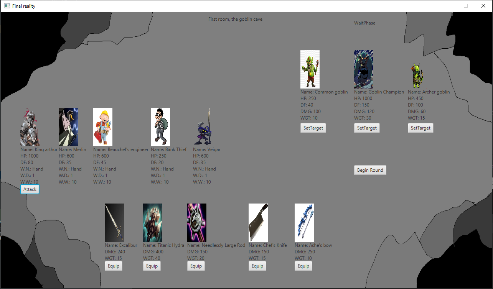
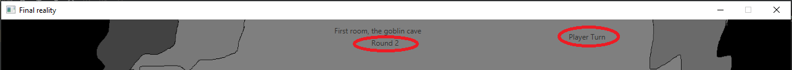
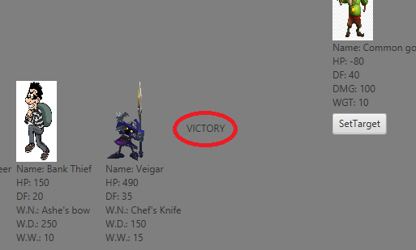
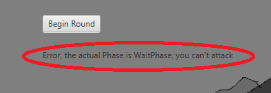

Final Reality
=============

This work is licensed under a 
[Creative Commons Attribution 4.0 International License](http://creativecommons.org/licenses/by/4.0/)

Context
-------

This project's goal is to create a (simplified) clone of _Final Fantasy_'s combat, a game developed
by [_Square Enix_](https://www.square-enix.com)
Broadly speaking for the combat the player has a group of characters to control and a group of 
enemies controlled by the computer.

Como usar
---

Este proyecto tiene la clase FinalReality, la cual al ejecutarla abre un juego cuya mecanica es muy parecida a los combates de Final Fantasy.
La pantalla que aparece al hacer esto es la siguiente:

En esta aparecen los personajes del jugador, en el sector medio izquierdo, los enemigos en el sector superior derecho y las armas en el sector
inferior, todos estos con sus respectivas caracteristicas (nombre , peso, daño , etc). Tambien aparecen componentes esteticos como imagenes de
los peronsajes, y las armas, aparece un cartel con el nombre de la etapa, arriba al centro, y otro con la actual fase del juego, arriba a la derecha.
Ademas hay un fondo para ambientar el combate.

En la pantalla tambien aparecen una serie de botones para poder llevar a cabo el juego, el boton "Begin Round" que aparece en el sector central derecho
lo que hace es iniciar una nueva ronda (o si es la primera vez que se acciona este empezara el juego), este deberia ser el primer boton en accionarse
para jugar, la forma correcta de uso es hacerlo mientras se esta en la Wait Phase. Tambien esta el boton "Attack", este boton sirve para que el 
personaje del jugador actual(aquel que esta sobre el boton) ataque al personaje del enemigo seleccionado, los enemigos atacan de manera automatica a un personaje del jugador al azar.
Ademas estan los botones "Set Target", los cuales seleccionan el objetivo o target del personaje acutal del jugador, se pueden seleccionar un objetivo 
varias veces en un turno, pero solo se atacara al ultimo seleccionado. Finalmente estan los botones "Equip", los cuales equipan el arma que se encuentra
sobre el boton al personaje del jugador que este jugando actualmente, esta accion se puede realizar varias veces por turno, pero un personaje del jugador
solo puede tener equipada un arma.

Al presionar el boton "Begin Round", se tendra que esperar unos segundos (aproximadamente 6 segundos) y empezar la nueva ronda (o juego), luego de los 6
segundos aparece un cartel que indica la ronda acutal, y se cambiara la fase actual (de WaitPhase a Player/Enemy Turn), esto se puede ver en la siguiente
 imagen:
 
 
 
 
Con esto ya se puede empezar a jugar, el juego terminara cuando todos los personajes del jugador o todos los enemigos sean derrotados, ganara el bando que
tenga personajes en pie. Un turno  generalmente consistira en, equipar un arma al personaje del jugador, seleccionar un objetivo y atacarlo, en cuanto 
todos los personajes vivos hayan atacado, se pasara a la Wait Phase y se esperara a que el jugador actual presiona el boton "Begin Round" para empezar 
una  nueva ronda. En caso de que el juego se termine, se pondra un cartel en el centro de la pantalla indicando el resultado del enfrentamiento (VICTORY 
o DEFEAT), esto se puede ver en la siguiente imagen:

En caso de que se accionen los botones en momentos que no corresponda hacerlo, se imprimira un mensaje bajo el boton "Begin Round", el cual indicara el error
cometido, un ejemplo de esto es el siguiente:

Funcionamiento y logica del programa
---

La interfaz del programa, encargada de mostrar el juego al usuario, es la que crea y pide recursos al controlador, este es el encargado de mediar todas las
acciones del juego, desde las interacciones del modelo con le mismo, como el verificar que se este cumpliendo con las reglas del juego (un turno por vez,
que un personaje no ataque 2 veces, etc), el modelo es que el que contiene toda la informacion sobre los elementos propios del juego (atomicos) y las 
interacciones entre estos.

La forma en que funciona la interfaz, es que crea al controlador y le da los objetos del juego (a traves de un string), el controlador crea el juego y lo
deja en WaitPhase, esperando a que la interfaz le comunique que inicie el juego (a traves del boton Begin Round), luego de que se inicie el juego, la 
interfaz constantemente le ira solicitando informacion al controlador y le ira dando las instrucciones del usuario para llevar a cabo el juego (esto a 
traves de los botones), el controlador es el encargado de ver si estas instrucciones son validas y manejarlas en caso de que no lo sean. Todas las acciones
de la interfaz son llevadas al modelo y viceversa por el controlador, gracias al modelo el juego tiene sentido y las acciones estan bien definidas. Finalmente
el juego se detiene (y se imprime el mensaje final), cuando el controlador comunica que el juego se ha acabado, esto ocurre cuando todos los personajes de un
bando mueren.